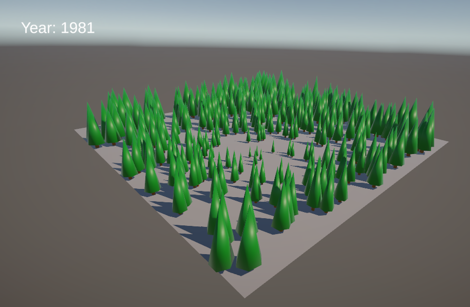

# Visualization Module Prototype

Prototype for the **standSIM** forest simulator’s visualization module.

*Update* 
- Thinned trees appear as just a trunk;
- When red trees appear means that the tree was alive and it just died in that instant
- Use `P` to see the parallel view;

## 📦 How to Download

1. Clone the repository.
2. Open Unity Hub.
3. Add the project by selecting the cloned folder from disk.

## ▶️ How to Use

1. **Play the project** in the Unity Editor.
2. **Provide a CSV file** with the tree data output from standSIM.  
   - An example CSV is included in the root of the project — you can use it to test the visualization.
3. **Set the parsing interval** using the input box.  
   - For example, entering `5` will only parse data every 5 years.
4. **Parsed data** will be displayed in a draggable table.
5. **Navigate through years** using the arrow keys.  
   - Left arrow (`←`): Previous year.  
   - Right arrow (`→`): Next year.  
   - Note: If it doesn't go immediately to the next year its because there was an occurence in that year.
6. **Enter 3D mode** by pressing `Space`.
7. **In 3D mode**, you can:
   - Zoom in: `Z`  
   - Zoom out: `X`  
   - Move the camera: drag the mouse
   - Click on a tree to see its detailed information
   - Change to parallel view: `P`
   - Note: Thinned trees appear as just a trunk and red trees means that tree was alive and it just died in that instant;

## 🕹️ TL;DR Controls

| Key / Action       | Function                            |
|--------------------|-------------------------------------|
| `Space`            | Toggle between 3D view and data panel |
| `←` (Left Arrow)   | Go to previous year                 |
| `→` (Right Arrow)  | Go to next year                     |
| `Z`                | Zoom in (3D mode only)              |
| `X`                | Zoom out (3D mode only)             |
| Mouse Drag         | Move the camera (3D mode only)      |
| Click on Tree      | Show information about the tree (3D mode only)    |
| P      | Change to parallel view (3D mode only)    |

## 📬 Contact

If you encounter any issues or have feedback, feel free to reach out:

**Email**: [jm.amorim@campus.fct.unl.pt](mailto:jm.amorim@campus.fct.unl.pt)
