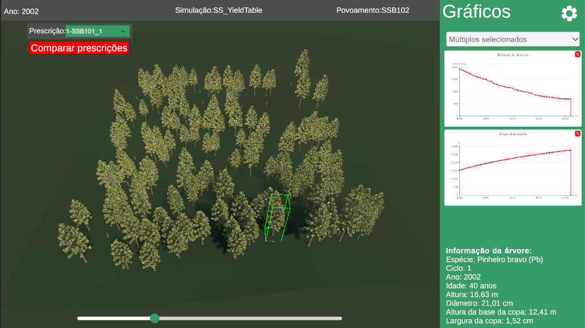

# Visualization Module for standsSIM forest simulator

Visualization Module for stadndsSIM forest simulator. This works was created for the thesis "DESENVOLVIMENTO DE UM MÓDULO DE VISUALIZAÇÃO PARA SIMULADOR DA FLORESTA" at FCT NOVA 

This repository is dedicated to Unity project of the visualization module if you wish to try hands on the module itself follow the following link that contains the app, a manual and a video demo: https://drive.google.com/file/d/1esd6RvyJGqu6PZTz_Y8l8z8EEp64WfJL/view?usp=drive_link

Link to the thesis: soon...

## 📬 Contact

If you encounter any issues or have feedback, feel free to reach out:

**Email**: [jm.amorim@campus.fct.unl.pt](mailto:jm.amorim@campus.fct.unl.pt)
